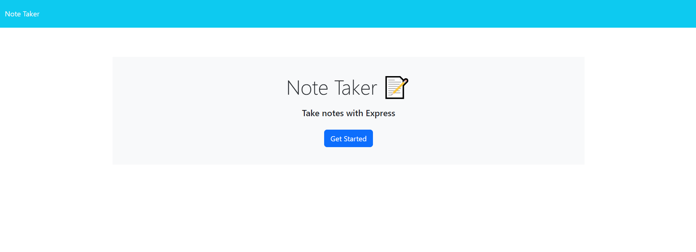
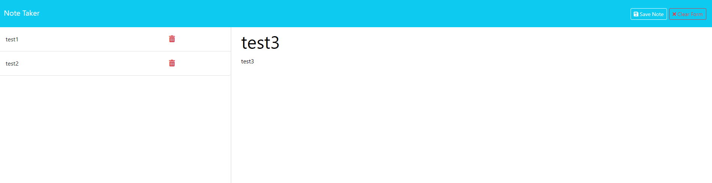
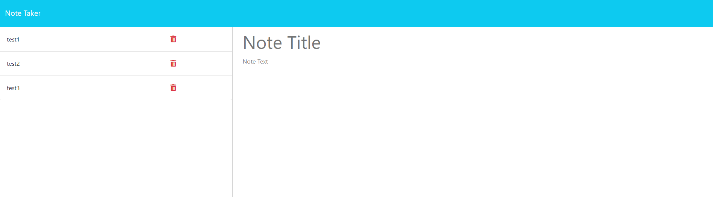

# Note Taker

  ## Description
  Note Taker is an express application that allows users to create and store notes that persist!

  ## Table of Contents
  - [Description](#Description)
  - [Screenshots](#Screenshots)
  - [Links](#Links)
  - [Installation](#Installation)
  - [Usage](#Usage)
  - [Questions](#Questions)

  ## Screenshot
  Note Taker Home screen.
  

  ---
  Creating a note before saving.
  

  ---
  Creating a not after saving.
  
  ---

  ## Links
  [Deployed Application](https://mod11-note-taking-application-dbcc00f113a7.herokuapp.com/)

  ## Installation
  After the application has been cloned, the next step is to run 'npm i' in the terminal. After that, run 'nodemon server.js' in the terminal and pull up the application on the browser at the designated localhost.

  ## Usage
  As a user, you may want to write a note to look at later. This application is a great way to stay organized!

  ## Questions
  Checkout my GitHub at [clayguerrero](https://github.com/clayguerrero)
  You can reach out to me for more questions at claytondguerrero@gmail.com
